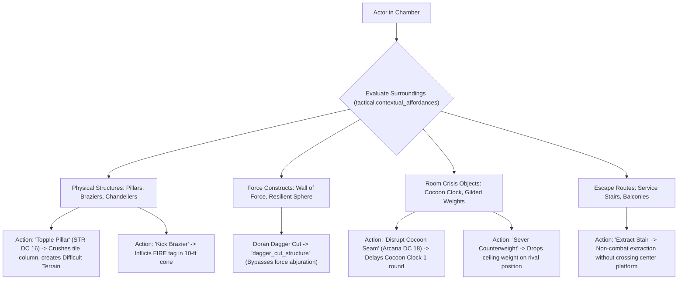
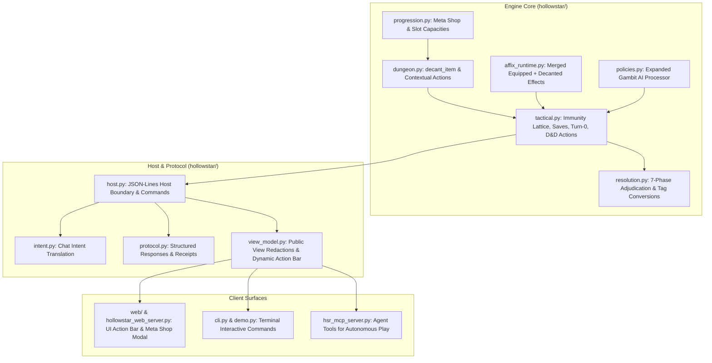

# Foundational Specification: Limitless Contextual Actions, Meta Shop Attunement, and Tactical Dynamics

> **Module**: Hollow Star Reliquary (HSR) Game Engine  
> **Status**: Foundational Design & Architecture Plan  
> **Authority**: Engine-Scoped Software Specification (Governed by `GEMINI.md`)  
> **Target Surfaces**: Host Core (`hollowstar/`), Browser Web Client (`web/`), CLI, and MCP Server (`hsr_mcp_server.py`)

---

## 1. Executive Summary

This specification lays the architectural foundation for transforming HSR into a deeply immersive, highly tactical RPG with limitless contextual action possibilities, satisfying idle/AFK automation, and a multi-layered progression system. 

It unifies four interlocking systems:
1. **Near-Limitless Contextual Action Engine**: A full D&D 5e-compliant action economy (Actions, Bonus Actions, Reactions, Free Object Interactions, Maneuvers, Spells, and Environmental Affordances) that dynamically exposes legal actions based on the actor's surroundings, held gear, room hazards, and enemy posture.
2. **Meta Shop & Attunement Slot Matrix**: An account-level progression loop where Platinum meta-currency expands **Prefix, Suffix, and Legendary Attunement Slots**, enabling players to permanently absorb (decant/disenchant) gear affixes into their character sheets.
3. **The 7-Phase Immunity Lattice**: A deterministic defense pipeline adhering to D&D ability scores (STR, DEX, CON, INT, WIS, CHA), saving throws, ability-score thresholds, and conceptual damage conversions, allowing players to build theoretically invulnerable characters to conquer Floor 5: *The Opulent Palace and Cocoon*.
4. **Turn-0 Pre-Emption & The Gambit Scripting Framework**: A declarative, priority-based IF/THEN automation framework (inspired by *FFXII Gambits* and *Siralim Ultimate*) allowing characters to resolve combat autonomously with high tactical fidelity.

---

## 2. Near-Limitless Contextual Actions (D&D 5e & Interactive Environment)

### 2.1 The Unified Action Economy
Every combat participant (player champion, companion, steward, or monster) operates within a structured per-turn economy managed in `tactical.py`:
* **1 Standard Action**
* **1 Bonus Action**
* **1 Reaction** (refreshed at the start of the actor's turn)
* **Movement Budget** (in feet, priced through `tactical.move_cost` per square)
* **1 Free Object / Environmental Interaction**

### 2.2 Standard Combat Actions Catalog
The engine projects contextual legality for all standard D&D actions based on current spatial and status state:

| Action | Cost | D&D Mechanism | Legal Context & Engine Resolution |
| :--- | :--- | :--- | :--- |
| **Attack** | Action | Weapon roll (`d20 + atk_bonus` vs AC) | Standard weapon strike or multiattack. Supports dual-wielding, ranged bands, and damage tags. |
| **Cast Spell** | Action / Bonus | Spell Slot / Resource + Save DC or Spell Attack | Full spell resolution (`Fireball`, `Arcane Bolt`, `Portal Shear`, `Healing Word`). |
| **Maneuver** | Action + Die | Superiority Die + Ability Save vs DC | Tactical battlemaster maneuvers: *Disarming Attack* (STR DC 22), *Trip Attack*, *Pushing Attack*. |
| **Dash** | Action | Movement += Base Speed | Doubles available movement budget for the turn. |
| **Dodge** | Action | Disadvantage on attacks against actor; Adv on DEX saves | Applies `DODGING` status until start of next turn; attacks made against actor roll with disadvantage. |
| **Disengage** | Action | Movement does not provoke Opportunity Attacks | Applies `DISENGAGING` status; passing through enemy threat zones incurs 0 reaction attacks. |
| **Help** | Action | Grants Advantage to ally's next attack / check | Context: Ally within 5 ft of target enemy. Sets `advantage=True` on ally's next resolution. |
| **Hide** | Action | Stealth Check vs Passive Perception | Context: Requires cover or darkness. Applies `HIDDEN` status; gives advantage on next strike. |
| **Shove** | Action | Athletics check contested by target Athletics/Acrobatics | Knocks target **Prone** or pushes target 5–10 ft backward (potentially into hazards, pits, or difficult terrain). |
| **Grapple** | Action | Athletics check contested by target Athletics/Acrobatics | Target speed becomes 0; attacker can drag target at half speed. |
| **Use Object / Item** | Action / Free | Item consumption or object actuation | Drinking potions, throwing alchemical fire, donning/doffing shields, triggering switches. |
| **Ready Action** | Action + Reaction | Conditional trigger: `WHEN <trigger> THEN <action>` | Pre-declares a reaction to fire outside the actor's initiative tick. |

### 2.3 Contextual Environmental Affordances
Rooms in HSR are physical, spatial chambers with authored terrain, structures, and tells. The engine evaluates proximity and tags to offer contextual environment interactions:



---

## 3. The Meta Shop & Attunement Slot Matrix

### 3.1 The Problem It Solves
Grinding in traditional ARPGs and rogue-lites frequently results in "loot bloat," where 95% of drops are vendored. In HSR, every drop is fuel for permanent character customization.

### 3.2 Attunement Slot Architecture
Characters have **Equipped Gear** (Weapon, Armor, Relic) and an independent **Attunement Matrix** representing powers absorbed into their soul:

```
┌────────────────────────────────────────────────────────────────────────┐
│                   CHARACTER ATTUNEMENT MATRIX                           │
├─────────────────────────┬───────────────────────┬──────────────────────┤
│      PREFIX SLOTS       │     SUFFIX SLOTS      │   LEGENDARY SLOTS    │
│   (Offensive / Damage)  │  (Riders / Utility)   │ (Unique Rule Benders)│
├─────────────────────────┼───────────────────────┼──────────────────────┤
│ Slot 1: [Petty]         │ Slot 1: [of Silence]  │ Slot 1: [Void Shroud]│
│ Slot 2: [Cruel]         │ Slot 2: [of Ice]      │ Slot 2: [Mirror Core]│
│ Slot 3: [Void-Forged]   │ Slot 3: [of Thorns]   │ Slot 3: [Limit Break]│
│ Slot 4: (Meta Locked)   │ Slot 4: (Meta Locked) │ Slot 4: (Meta Locked)│
│ Slot 5: (Meta Locked)   │ Slot 5: (Meta Locked) │ Slot 5: (Meta Locked)│
│ Slot 6: (Meta Locked)   │ Slot 6: (Meta Locked) │ Slot 6: (Meta Locked)│
└─────────────────────────┴───────────────────────┴──────────────────────┘
```

### 3.3 Meta Shop Upgrade Tracks (`hollowstar/progression.py`)
Players bank **Platinum** meta-currency upon clearing rooms, completing runs, or extracting safely. The Meta Shop exposes three slot-expansion tracks:

1. **`prefix_capacity`**:
   * *Base*: 1 slot
   * *Cap*: 5 upgrades (Max: 6 slots)
   * *Base Cost*: 3 Platinum (`cost = base_cost * (tier + 1)`)
   * *Effect*: `+1 Decanted Prefix attunement slot per tier`
2. **`suffix_capacity`**:
   * *Base*: 1 slot
   * *Cap*: 5 upgrades (Max: 6 slots)
   * *Base Cost*: 3 Platinum
   * *Effect*: `+1 Decanted Suffix attunement slot per tier`
3. **`legendary_capacity`**:
   * *Base*: 1 slot
   * *Cap*: 5 upgrades (Max: 6 slots)
   * *Base Cost*: 4 Platinum
   * *Effect*: `+1 Decanted Unique/Legendary attunement slot per tier`

### 3.4 Decanting / Disenchanting Pipeline (`decant_item`)
* **Eligibility**: Any identified item in inventory of rarity `rare`, `imprint`, or `legendary`.
* **Execution**:
  1. The item is permanently destroyed from `dungeon.inventory`.
  2. If equipped in `dungeon.imprints`, it is cleanly unequipped.
  3. If the item carries a Prefix, it is slotted into the actor's next open `prefix` slot.
  4. If the item carries a Suffix, it is slotted into the actor's next open `suffix` slot.
  5. If the item carries unique modifiers or intrinsic effects (e.g. tag conversions, immunities), it is slotted into the `legendary` slot.
  6. If the target slot type is full, the player is prompted to choose which active affix to replace or upgrade their slot capacity in the Meta Shop.
* **Affix Runtime Bridge**: `affix_runtime.effects(run, actor_key)` retrieves all active equipped effects **plus** all active decanted effects in `dungeon.decanted_affixes[actor_key]`.

---

## 4. The 7-Phase Immunity Lattice & D&D Ability Resolution

### 4.1 The 7-Phase Adjudication Pipeline
Resolution walks seven strictly ordered phases in `hollowstar/resolution.py`. Real interactions never collide ambiguously:

```
[Phase 10: PERMISSION]   ──> May the actor act? Satisfies Conceptual Gate?
[Phase 20: TARGETING]    ──> May the target be selected? (Stealth, Sanctuary, Blindness)
[Phase 30: DELIVERY]     ──> Does it hit? Attack roll vs AC; cover; evasion
[Phase 40: APPLICATION]  ──> Does the concept touch the target? Full Tag Immunities
[Phase 50: MAGNITUDE]    ──> Damage calculation: Tag conversions, flat mods, multipliers, resistances
[Phase 60: CONSEQUENCE]  ──> Riders & Conditions: Saving throws, status immunities
[Phase 70: PERSISTENCE]  ──> Does it persist? Duration, concentration saves, purge
```

### 4.2 D&D Ability Saving Throws & Ability Thresholds
1. **Saving Throw Pipeline**:
   * When an attack, spell, or environmental consequence carries a status rider (e.g., Poison, Restrain, Stun, Disarm), it declares a `save_ability` (STR, DEX, CON, INT, WIS, CHA) and a `save_dc`.
   * The defender executes `tactical.saving_throw(run, target, ability, dc)`.
   * **Advantage / Disadvantage** is evaluated natively (e.g. *Doran's Indomitable*, *Wren's Aura of the Unbound*, *Haste* granting Adv on DEX saves).
   * **Legendary Resistance**: High-tier bosses and champion builds can spend Legendary Resistance charges to automatically turn a failed save into a success.
2. **D&D Ability Score Threshold Immunities**:
   * Characters with exceptional core stats gain natural immunities:
     * **CON >= 18**: Immune to mundane diseases and ordinary poisons.
     * **WIS >= 18**: Immune to *Frightened* and *Charmed* conditions.
     * **STR >= 18**: Immune to non-magical Knockdown and Shove effects.
     * **DEX >= 18 (with Evasion)**: Takes 0 damage on successful DEX saves against area effects, and half damage on failure.

### 4.3 Damage Tag Conversions & Complete Invulnerability
To defeat the 5 rival positions on Floor 5 (*The Opulent Palace*), builds stack tag conversion and gate nullification:
* **Tag Conversion (Phase: MAGNITUDE)**:
  * Effect: `converts_tag_from="SLASHING", converts_tag_to="ARCANE"`
  * When a rival attacks with a slashing halberd (`2d10+8`), the incoming damage tag becomes ARCANE.
* **Tag Immunity (Phase: APPLICATION / MAGNITUDE)**:
  * Effect: `immune_tags=["ARCANE"]`
  * Incoming Arcane damage is completely nullified (Damage = 0).
* **Consequence Denial (Phase: CONSEQUENCE)**:
  * Effect: `DENY` direction on `STUN`, `BLEED`, and `DISARM`.
  * Status riders are rejected with visible tell evidence.

---

## 5. Turn-0 Pre-Emption & Start-of-Combat Triggers

### 5.1 Turn-0 Lifecycle in `tactical.begin()`
Before Round 1 initiative begins, the engine runs `resolve_start_of_combat(run)`:

```
[tactical.begin() Invoked]
     │
     ▼
[Initialize Actors, Rules & Economy]
     │
     ▼
[Step 1: Resolve Pre-Emptive Start-of-Combat Triggers]
   ├── 1. Generate Starting Ward Shields (Progression & Affixes)
   ├── 2. Apply Combat Aura Buffs (Aura of the Unbound, Divine Presence)
   ├── 3. Fire Turn-0 Pre-Emptive Strikes (Opening Volley, Ambush Traits)
   └── 4. Check Surprise States & Alert Feats
     │
     ▼
[Step 2: Roll Initiative (d20 + initiative_bonus)]
     │
     ▼
[Step 3: Begin Round 1 (cursor = 0)]
```

### 5.2 Palace Floor Payoff
In the Opulent Palace, entering the boss chamber with maxed Start-of-Combat affixes causes:
* A massive Divine Ward equal to 50% max HP to deploy instantly.
* Pre-emptive AoE shockwaves to strike all 5 rival positions before Round 1 initiative rolls, neutralizing weaker rival minions before they can draw weapons.

---

## 6. The Macro / Gambit Tactical AI Framework

### 6.1 Declarative Gambit Schema
Gambits allow automated, high-level tactical scripting for Idle/AFK progression. Stored per actor in `run.context['macros'][actor_key]`:

```json
{
  "id": "heal_critical_ally",
  "priority": 1,
  "when": {
    "ally_hp_below": 35,
    "has_resource": "slot_1_general"
  },
  "then": {
    "type": "cast",
    "spell": "Healing Word@5e",
    "target": "lowest_hp_ally"
  }
}
```

### 6.2 Condition Vocabulary (`when`)
* `self_hp_below` / `self_hp_above`: Percent HP threshold (0–100).
* `ally_hp_below` / `ally_hp_above`: Target ally percent HP threshold.
* `enemy_hp_below` / `enemy_hp_above`: Target enemy percent HP threshold.
* `round_number_gte` / `round_number_lte`: Turn count conditions.
* `cocoon_rounds_gte` / `cocoon_rounds_lte`: Specific to Floor 5 Cocoon Clock.
* `enemy_casting`: Fires when target enemy is currently channeling or casting.
* `has_resource`: Checks availability of named pools (`superiority_dice`, `spell_slot`, `potion`, `second_wind`).
* `enemy_status` / `self_status`: Checks presence of status condition.
* `enemy_count_gte`: Triggers AoE prioritization when multiple targets cluster.

### 6.3 Target Selectors (`target`)
* `self`: The acting character.
* `nearest_enemy`: Nearest legal opponent by Manhattan grid distance.
* `lowest_hp_enemy`: Opponent with lowest current HP percentage.
* `highest_hp_enemy`: Opponent with highest current HP (boss focus).
* `lowest_hp_ally`: Ally with lowest current HP percentage.
* `casting_enemy`: Opponent currently in casting phase (for interrupts).

### 6.4 Action Constructors (`then`)
* `attack`: Standard strike (supports `bonus: true` or specific weapon/mode).
* `cast`: Spells (`spell: "<name>"`, `target: "<selector>"`, or `center: [x, y]`).
* `maneuver`: D&D superiority maneuvers (*Disarming Attack*, *Trip Attack*).
* `potion` / `item`: Instant item consumption.
* `dodge` / `dash` / `disengage`: Tactical standard actions.
* `second_wind` / `unearthly_recovery`: Class recovery features.

---

## 7. Integration Plan: Implement, Add, Host, and Join

The implementation integrates seamlessly into the existing repository without breaking existing contracts:



### 7.1 Engine Core Integration
* **`hollowstar/progression.py`**:
  * Expand `UPGRADES` dictionary with `prefix_capacity`, `suffix_capacity`, `legendary_capacity`.
  * Update `purchase()` to validate and deduct Platinum, updating `upgrades` atomically.
* **`hollowstar/dungeon.py`**:
  * Initialize `decanted_affixes` structure in `enter()`.
  * Add `decant_item(run, item_id, actor_key)` supporting rare, imprint, and legendary loot.
  * Connect `decant`, `disenchant`, and contextual D&D commands (`dodge`, `dash`, `shove`, `help`) into `design_action`.
* **`hollowstar/affix_runtime.py`**:
  * Modify `effects()` to query both `_equipped()` and `dungeon['decanted_affixes']`.
  * Add tag conversion helpers and merge decanted resistances and skill bonuses.
* **`hollowstar/tactical.py`**:
  * Implement `resolve_start_of_combat(run)` in `begin()`.
  * Integrate D&D saving throws (`saving_throw`) into consequence rider processing.
  * Implement standard D&D actions (`dodge`, `dash`, `disengage`, `shove`, `help`) into the tactical loop.
* **`hollowstar/policies.py`**:
  * Expand condition matching (`_macro_matches`) and target resolution (`_macro_target`).

### 7.2 Host Boundary & Intent Translation (`hollowstar/host.py` & `intent.py`)
* **Host Commands**:
  * Add `meta_shop_inspect` and `meta_shop_purchase` to `CONTENT_COMMANDS` / `RUN_MUTATION_COMMANDS`.
  * Expose `decant_item` and `configure_macros` through host action dispatching with public receipts.
* **Intent Grammar (`intent.py`)**:
  * Recognize natural phrasing:
    * `"decant <item> for <actor>"` / `"disenchant <item>"`
    * `"dodge"`, `"dash"`, `"disengage"`
    * `"shove <target>"`, `"grapple <target>"`, `"help <ally>"`
    * `"set gambit <priority>: if <condition> then <action> on <target>"`

### 7.3 Client Surfaces Join
* **Browser Client (`web/`)**:
  * **Dynamic Contextual Action Bar**: Renders available actions categorized into *Standard*, *Bonus*, *Tactical (D&D)*, and *Environmental* based on current spatial state.
  * **Meta Shop Modal**: Visual display of available Platinum and upgrade tiers with slot indicators.
  * **Gambit Builder Interface**: Visual priority-ordered card stack for configuring character AI.
* **MCP Server (`hsr_mcp_server.py`)**:
  * Expose tools: `hsr_decant_item`, `hsr_meta_shop_purchase`, `hsr_configure_gambits`, `hsr_contextual_action` allowing AI agents to interact with all new systems.

---

## 8. Verification & Acceptance Criteria

Every phase adheres to the workspace verification contract (`GEMINI.md`):

1. **Test Runner Compliance**:
   ```powershell
   python tools/run_discovered_tests.py
   ```
   * Must pass 100% of all 458 existing tests across all 44 test modules with zero regressions.
2. **Dedicated Test Suite (`tests/test_contextual_and_meta_dynamics.py`)**:
   * **Meta Shop Purchases**: Validate Platinum costs, tier clamping (cap 5), and atomic serialization.
   * **Decanting System**: Validate item destruction, slot capacity enforcement, and active affix absorption.
   * **The Immunity Lattice**: Verify that Slashing -> Arcane conversion paired with Arcane immunity yields exactly 0 damage.
   * **D&D Saving Throws**: Verify CON save DC 15 negates poison riders; WIS save DC 15 negates fear riders.
   * **Start-of-Combat Triggers**: Verify Turn-0 ward shields and pre-emptive strikes fire before Round 1 initiative.
   * **Gambit Automation**: Verify priority execution, cocoon clock threshold triggers, and resource consumption.
   * **Replay Determinism**: Verify that identical seeds reproduce identical event transcripts with decanted affixes and gambits.

---

## 9. Phased Execution Roadmap

* [ ] **Phase 1: Meta Shop & Attunement Slot Engine** (`progression.py`, `dungeon.py`, `affix_runtime.py`)
* [ ] **Phase 2: The Immunity Lattice & D&D Saving Throws** (`tactical.py`, `resolution.py`)
* [ ] **Phase 3: Start-of-Combat Turn-0 Pre-Emption** (`tactical.py`, `dungeon.py`)
* [ ] **Phase 4: Expanded Gambit / Macro AI Processor** (`policies.py`, `dungeon.py`)
* [ ] **Phase 5: Contextual Action Catalog & Intent Translation** (`tactical.py`, `intent.py`, `host.py`)
* [ ] **Phase 6: Web Client UI & MCP Server Join** (`web/`, `hollowstar_web_server.py`, `hsr_mcp_server.py`)
* [ ] **Phase 7: Full Regression Verification & Acceptance Run** (`tools/run_discovered_tests.py`)
